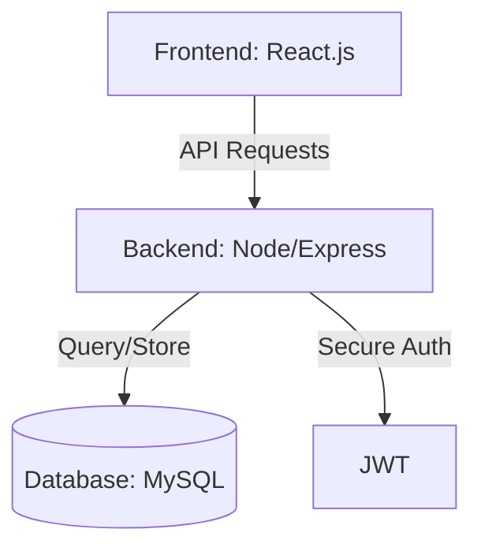

Here is a polished, professional `README.md` for your **SpendWise** project. I have structured it to follow industry standards, making it ready for your GitHub repository.

---

# 💰 SpendWise – AI-Based Budget Tracker

**SpendWise** is a full-stack AI-powered budget management web application designed to help users take control of their finances. By tracking income and expenses and leveraging smart insights, SpendWise makes real-world financial management simple and efficient.

---

## 🚀 Key Features

* **🔐 Secure Authentication:** JWT-based user Login and Signup system.
* **💰 Transaction Management:** Seamlessly add, view, and manage income and expenses.
* **📊 Smart Dashboard:** Overview of total income, expenses, and current balance at a glance.
* **🤖 AI Insights:** Receive AI-generated financial insights and spending predictions.
* **📋 History Tracking:** Comprehensive tables for historical transaction data.
* **🔄 Real-Time Updates:** Instant data synchronization across the UI.
* **🎨 Modern UI:** Clean, responsive design for a premium user experience.

---

## 🛠️ Tech Stack

### **Frontend**

* **React.js** – UI Framework
* **Axios** – API Communication
* **CSS3** – Custom Modern Styling

### **Backend**

* **Node.js** – Runtime Environment
* **Express.js** – Web Framework
* **MySQL** – Relational Database
* **JWT** – Secure Authentication

---

## 🏗️ Project Architecture



---

## 📂 Project Structure

```text
SpendWise/
├── backend/
│   ├── config/         # Database connection configuration
│   ├── controllers/    # Request handling logic
│   ├── models/         # Database schemas/queries
│   ├── routes/         # API endpoints
│   ├── server.js       # Entry point
│   └── .env            # Environment variables
├── frontend/
│   ├── public/         # Static assets
│   ├── src/            # Components, Pages, and Logic
│   └── package.json    # Frontend dependencies
└── README.md

```

---

## ⚙️ Installation & Setup

### **1. Clone the Repository**

```bash
git clone https://github.com/shriramkulkarni/SpendWise.git
cd SpendWise

```

### **2. Backend Setup**

```bash
cd backend
npm install

```

*Create a `.env` file in the `backend` folder and add:*

```env
PORT=5000
JWT_SECRET=your_secret_key_here
DB_HOST=localhost
DB_USER=root
DB_PASSWORD=your_password
DB_NAME=spendwise

```

*Run the server:*

```bash
node server.js

```

### **3. Frontend Setup**

```bash
cd ../frontend
npm install
npm run dev

```

---

## 📸 Screenshots


---

## 🎯 Future Enhancements

* [ ] **📈 Visual Analytics:** Integration of Chart.js for visual spending trends.
* [ ] **🧾 Report Export:** Ability to download monthly statements in PDF/Excel.
* [ ] **🔔 Smart Alerts:** Push notifications for overspending or budget limits.
* [ ] **🤖 Advanced AI:** More granular budget recommendations based on user habits.

---

## 👨‍💻 Developer

**Shriram Kulkarni** *Computer Science Engineering Student* [LinkedIn](https://www.google.com/search?q=https://www.linkedin.com/in/shriram-p-kulkarni) | [GitHub](https://www.google.com/search?q=https://github.com/shrikul2204)

---

Would you like me to help you draft the `DB_NAME` table schemas so you can include a **Database Schema** section in the README as well?
